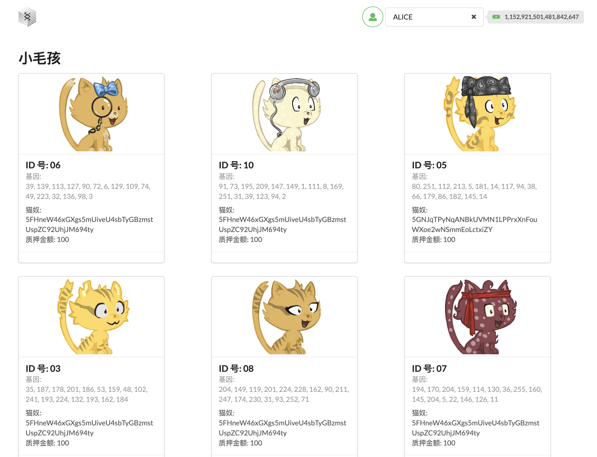

# Substrate Kitty Course Front-end

## Demo视频

[](https://drive.google.com/file/d/1OvWRq-HzEP-C79rAPGubLx0ceifnZ2YJ/view?usp=sharing)

## 使用教程

### 运行Node节点

```bash

# 克隆项目
git clone https://github.com/zhiquan911/substrate-node-template.git
cd ./substrate-node-template
git checkout oneblock

# 启动节点
cargo run --release -- --dev --tmp

```

### 运行前端

The codebase is installed using [git](https://git-scm.com/) and [yarn](https://yarnpkg.com/). This tutorial assumes you have installed yarn globally prior to installing it within the subdirectories. For the most recent version and how to install yarn, please refer to [yarn](https://yarnpkg.com/) documentation and installation guides. 

```bash
# 克隆项目
git clone https://github.com/zhiquan911/kitties-frontend
cd ./kitties-frontend
# 安装依赖
yarn install
# 启动项目
yarn start
```
